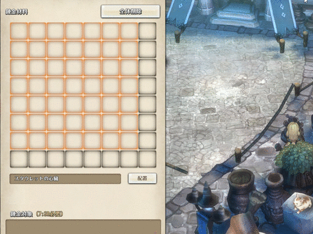
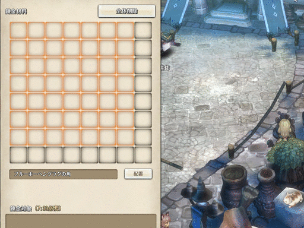

# ToSAddons
Addons for Tree of Savior

日本語は[こっち](README.ja.md)

## Alchemy

Add-on that add droplist for magnum opus.

### Install(manually)

1. Donwload IPF file.
2. Add an underscore at the beginning of the name of the IPF file and also give emoji.(eg. `alchemy-v0.2.0.ipf` -> `_alchemy-🔯-v0.2.0.ipf`)
3. Copy the IPF file to the data directory under the directory where Tree of Savior is installed.
4. Create the `alchemy` directory in the `addons` directory under the directory where Tree of Savior is installed.

## GuildmatesKai

Add-on that improved Guildmates.
